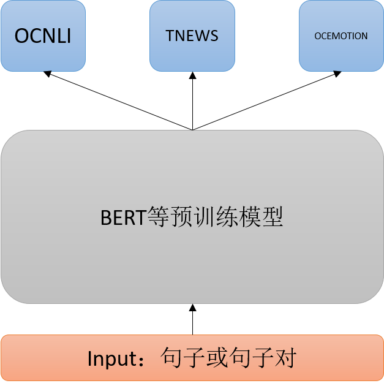

# 比赛
[阿里云天池人工智能大赛-中文预训练模型泛化能力挑战赛](https://tianchi.aliyun.com/competition/entrance/531841/information)

# 简单介绍
本次比赛的任务是实现一个泛化能力强的中文预训练模型，判断标准是在三个CLUE任务（OCNLI、OCEMOTION、TNEWS）上的性能。  
然而本次比赛的实际要求奇怪一些：不能针对单个任务进行fine-tuning 再预测，而是需要使用同一个预训练模型（bert），拼接不同的分类器做预测。所以这次比赛就变成了一个多任务的比赛。

# 思路
思路也比较简单，三个任务共享同一个backbone，然后拼接各种的分类器，训练时交替训练三个分类器。
更多的思路可以参考官方给的思路：[关于中文预训练模型泛化能力挑战赛的调研](https://tianchi.aliyun.com/forum/postDetail?spm=5176.12586969.1002.12.25a0249419u5hz&postId=145917)